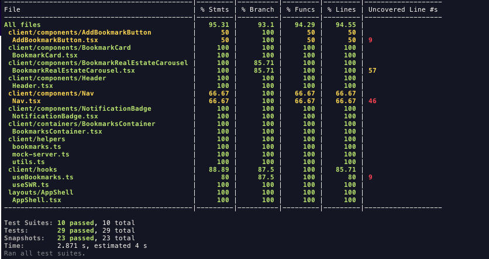

# La Haus coding challenge

- Created with [Nextjs](https://nextjs.org/) and [React](https://reactjs.org/)
- Deployed with [Vercel](https://vercel.com/)

🔗 [Website](https://lahaus-cc.vercel.app/)

## Coverage

## Keyfeatures (extras)

- Responsiveness for bigger screens.
- Page for the details of the bookmarks.
- Full responsive and interactive menu.
- Mix between CSSModules and inline classes (all with tailwind)